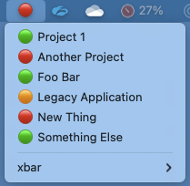

# Gitlab Pipeline RAG
An [xbar](https://xbarapp.com/) plugin to show the
RAG (Red, Amber, Green) status of Gitlab pipelines.



The overall status is shown in the menu bar
and the status of each project you are tracking is shown
in the dropdown.  You can click on any of the projects in
the dropdown to go to its pipeline page on Gitlab in your
default browser.

The meanings of the circles against each project is:

- 🟢 -> the most recent pipline passed
- 🔴 -> the most recent pipline failed
- 🟠 -> the most recent pipleline is running

Cancelled pipelines are ignored.

The meanings of the circle in the menu bar (showing the
overall status) is:

- 🟢 -> all the most recent pipelines passed
- 🔴 -> at least one of the most recent piplines failed
- 🟠 -> there are no failures and at least one of the
        pipelines is currently running

## Install
This is an [xbar](https://xbarapp.com/) plugin.  If it is
available (I have yet to submit it), you should install it
using the _Plugin browser_ in the xbar app itself.

You can also install it manually by copying the plugin script
into your plugin folder (which you can find via the xbar menu
_Open plugin folder..._).

## Setup
You will need to set a few things up once it is installed.

First, open the xbar _Plugin browser_ and select the plugin
in the left-hand pane. You will need to enter the url for
the Gitlab instance you wish to connect to as well as a
personal access token to allow API access.  You can
create one of these in your Gitlab profile; you will need
to selet the _read_api_ scope.

The final setting you need to enter is the PROJECTS_JSON,
which defines the projects whose pipelines you wish to
monitor. This is a list of names and Gitlab project IDs.
The names are the names that will appear in the plugin
dropdown and the ID for each project can be found by
going to the project page in Gitlab and looking in
Settings -> General.

```json
{"Project 1":1, "Project 2":34, "Project 3":27}
```

The plugin will run every 30s.  You can change this by
selecting the plugin in the _Plugin browser_ in xbar and
changing the Refresh setting.

## Issues
if a project you have configured doesn't appear in dropdown,
it could be that:

- the project ID is wrong
- the project has no pipelines
- all of the last 20 pipeline runs have been canceled

Theres not a huge amount of error checking in the script
so if plugin fails to connect to the gitlab instance, it
will show some errors in xbar!

